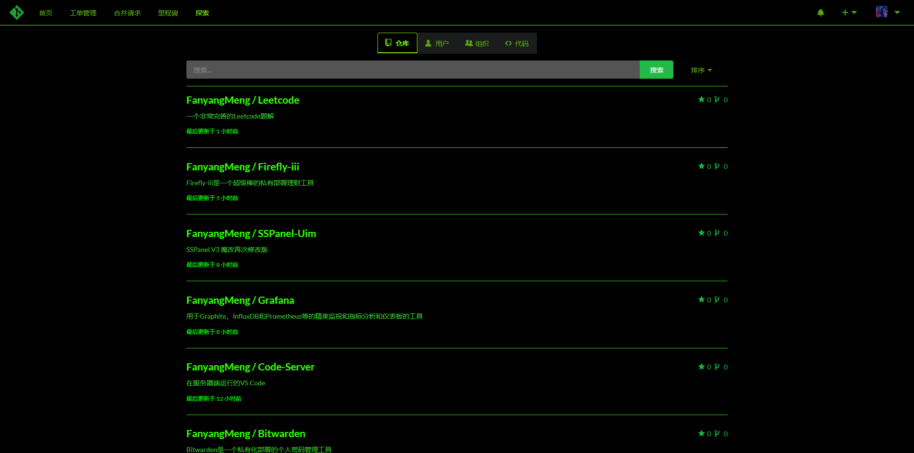
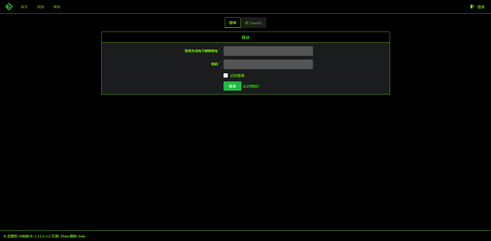
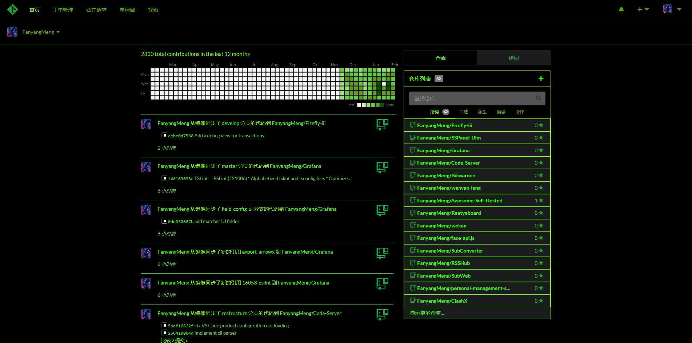
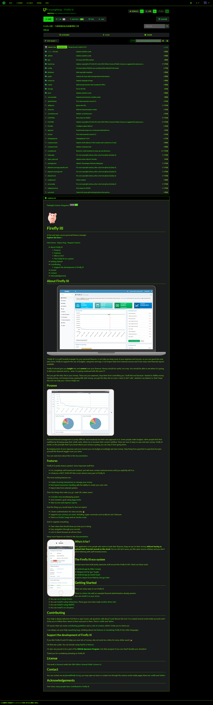
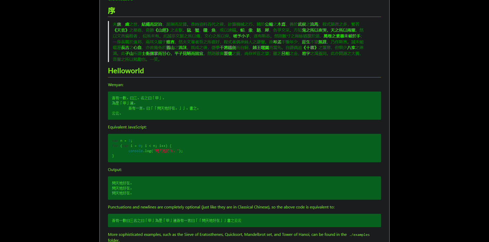
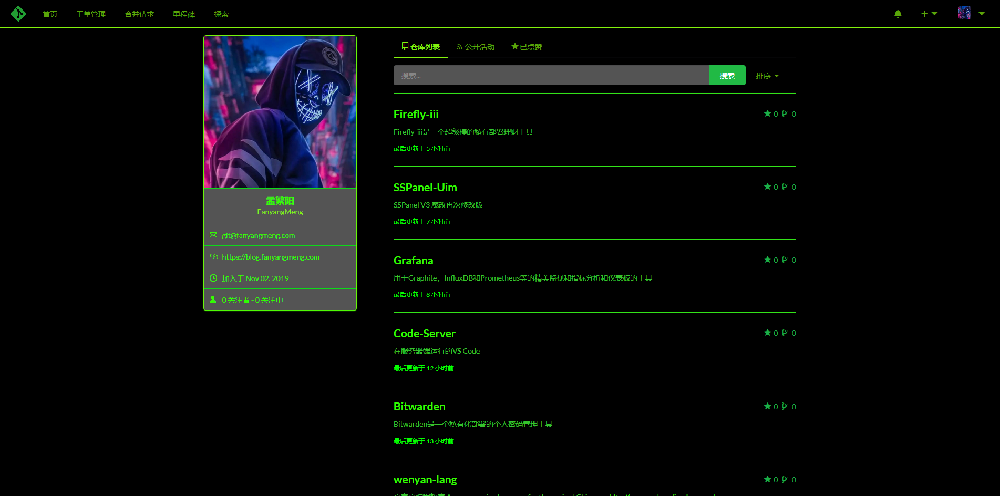
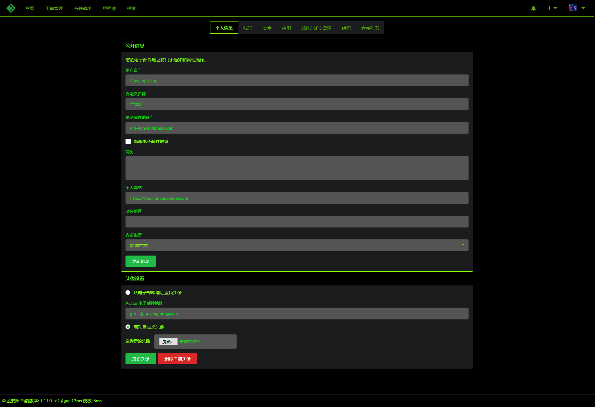

# Gitea Matrix Template- Turn your gitea arc-green template into the matrix

## Previews:

















## For Gitea Version ***1.10.3***

## How to use:
1. Find your gitea custom directory path in ***Site Administration > Configuration > Custom File Root Path***.
2. Create directories: ***templates*** and ***public/css*** within the directory, if it does not already exist. But please empty any previous files as they may create a conflict or unexpected behaviour.
3. Clone then Copy/Move files from this repo into the custom directory location.
4. Add folowing lines to your gitea config:
```ini
[ui]
THEMES = gitea,arc-green,matrix
DEFAULT_THEME = matrix
```
5. Restart your Gitea Service and you are ready to go.
### Welcome to the matrix!

### Special Notes:
 - A user can still change the theme settings.

### Special Thanks to 6543!
https://github.com/6543
